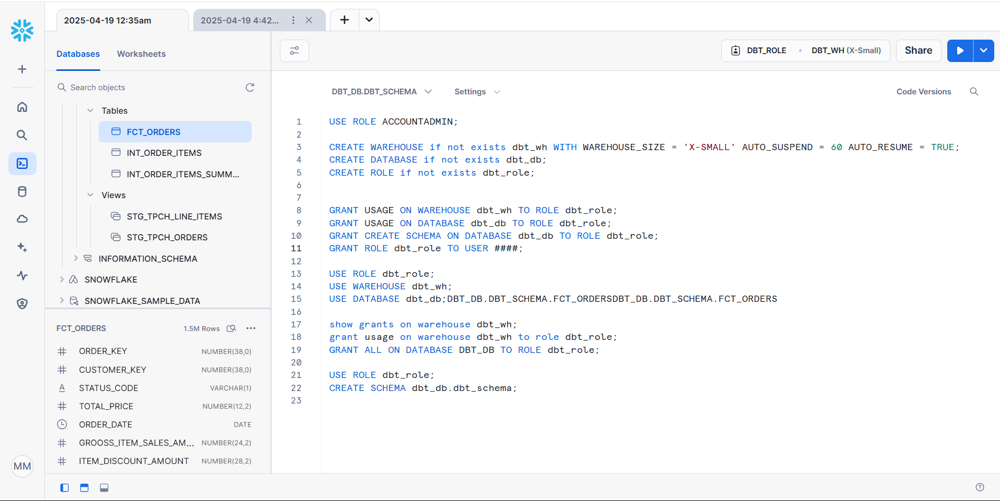
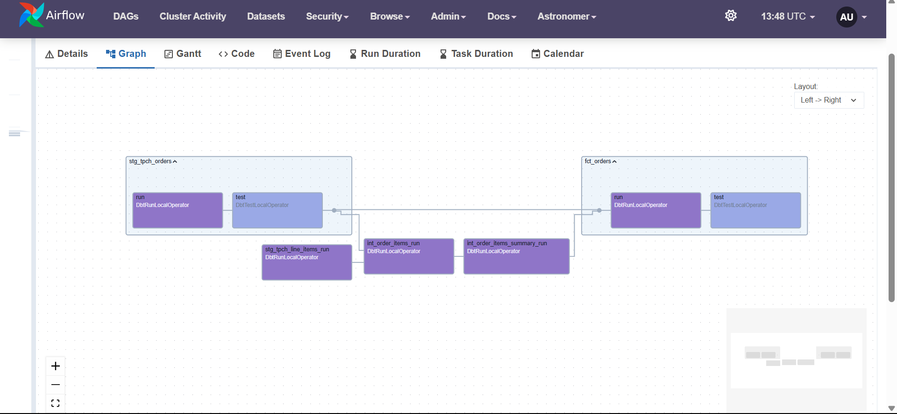

# ELT Data Pipeline with dbt, Snowflake, and Airflow

This project demonstrates a modern ELT (Extract, Load, Transform) data pipeline built using **dbt**, **Snowflake**, and **Airflow** (via Astronomer Cosmos). The pipeline models sample TPCH data in Snowflake and automates orchestration with Airflow.

## 📋 Table of Contents

- [Overview](#overview)  
- [Architecture](#architecture)   
- [Setup and Configuration](#setup-and-configuration)  
- [Detailed Walkthrough](#detailed-walkthrough)  
- [Future Improvements](#future-improvements)  

## Overview 📌

The goal is to build an end-to-end analytics workflow:

- Set up Snowflake roles and permissions
- Initialize and configure a dbt project
- Define source, staging, intermediate, and fact models
- Add reusable macros and tests
- Deploy and schedule models using Apache Airflow with Astronomer Cosmos

## Architecture 🏗️

```plaintext
Snowflake TPCH Data
      │
      ▼
  dbt (Staging Models)
      │
      ▼
dbt (Intermediate & Fact Models)
      │
      ▼
   Snowflake Tables & Views
      │
      ▼
   Airflow DAGs (via Cosmos)
```

## setup-and-configuration

### 1. Snowflake Environment

Run the following to set up roles, warehouse, and schema:

```sql
USE ROLE ACCOUNTADMIN;
CREATE WAREHOUSE IF NOT EXISTS dbt_wh WITH WAREHOUSE_SIZE = 'X-SMALL' AUTO_SUSPEND = 60 AUTO_RESUME = TRUE;
CREATE DATABASE IF NOT EXISTS dbt_db;
CREATE ROLE IF NOT EXISTS dbt_role;

GRANT USAGE ON WAREHOUSE dbt_wh TO ROLE dbt_role;
GRANT USAGE, CREATE SCHEMA ON DATABASE dbt_db TO ROLE dbt_role;
GRANT ROLE dbt_role TO USER <your_user>;

USE ROLE dbt_role;
USE DATABASE dbt_db;
USE WAREHOUSE dbt_wh;
CREATE SCHEMA IF NOT EXISTS dbt_schema;
```

### 2. Initialize dbt Project

```bash
dbt init
```

Then configure:
- `dbt_project.yml` for model settings
- `packages.yml` to include `dbt_utils`


## Detailed Walkthrough 🧠

### 1. Source Configuration

`tpch_sources.yml` defines Snowflake TPCH data and basic tests.

### 2. Staging Models

- `stg_tpch_orders.sql`  
- `stg_tpch_line_items.sql`  
Define surrogate keys and model views.

### 3. Fact & Intermediate Models

Inside `marts/`:
- `int_order_items.sql`
- `int_order_items_summary.sql`
- `fct_orders.sql`



### 4. Macros

`macros/pricing.sql` contains reusable business logic.

### 5. Tests

- `generic_test.yml` for reusable checks
- `fct_orders_date_valid.sql` and `fct_orders_discount.sql` for custom assertions


## Airflow Deployment 🚀

### 1. Install and Initialize

```bash
brew install astro
astro dev init
```

### 2. Update Requirements

```
astronomer-cosmos
apache-airflow-providers-snowflake
dbt-core
dbt-snowflake
```

### 3. Start Airflow

```bash
astro dev start
```

### 4. Set Up DAG

- Move `dbt/data_pipline/` into `dags/`
- Ensure `dbt_dag.py` is correctly defined
- Set up Snowflake connection in Airflow UI under `Admin > Connections`

Trigger the DAG when ready!


## Future Improvements 🌱

- Add logging and alerting for Airflow DAGs
- Automate deployment via CI/CD (GitHub Actions)
- Extend to include dimension tables
- Build Power BI dashboards from Snowflake output

---